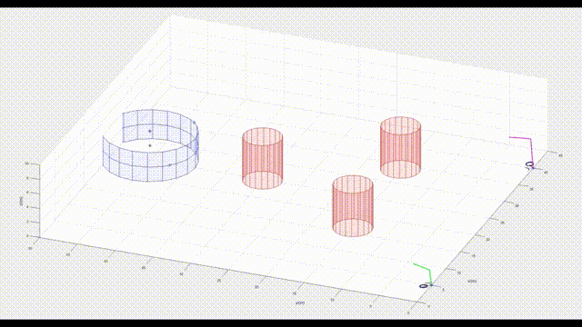
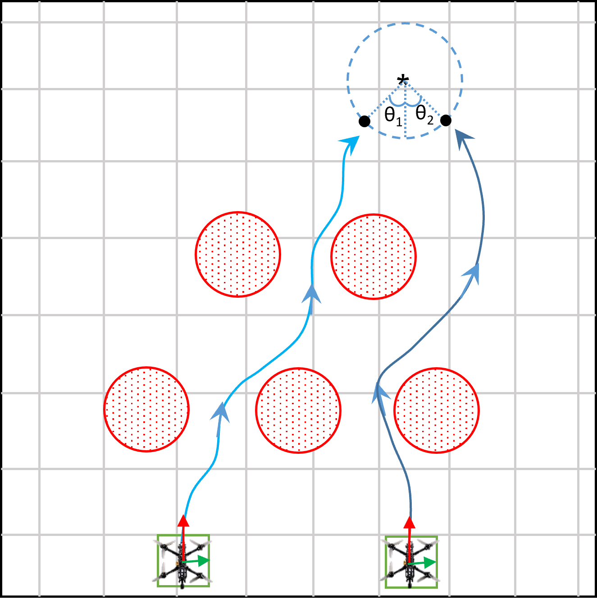
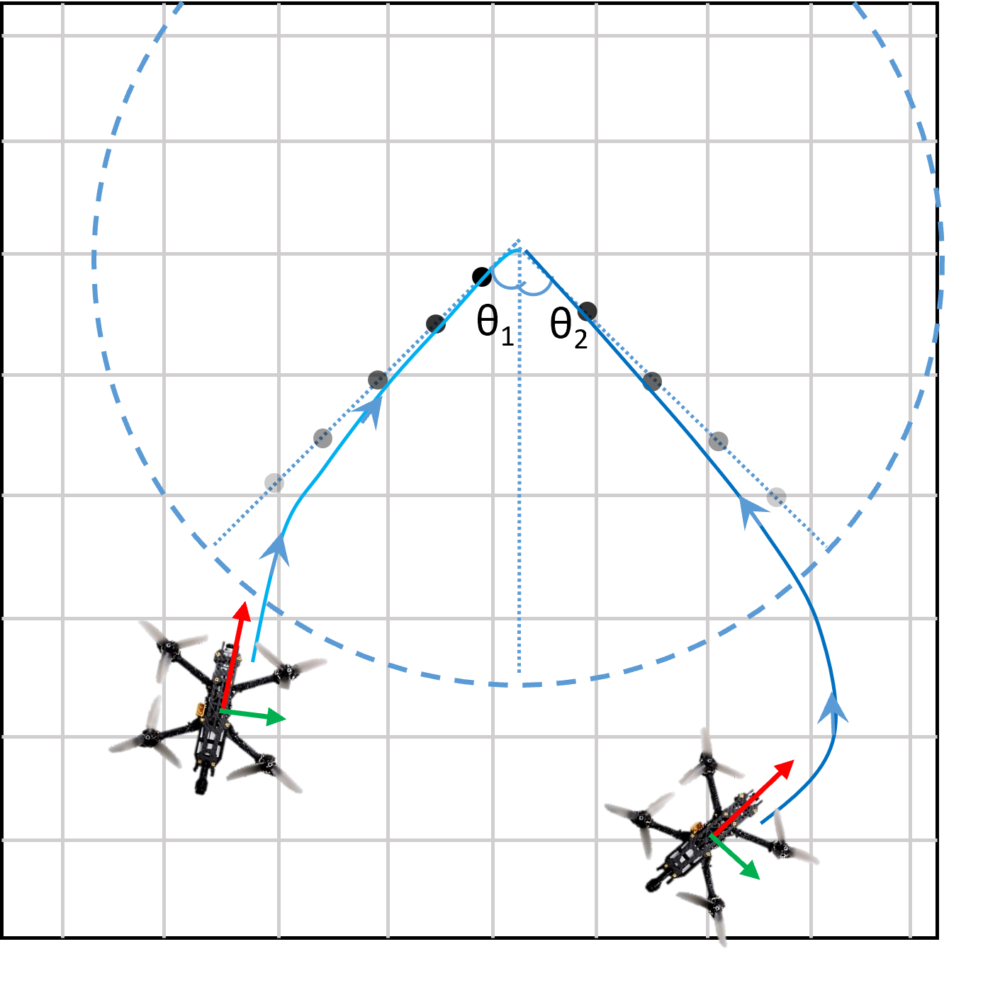
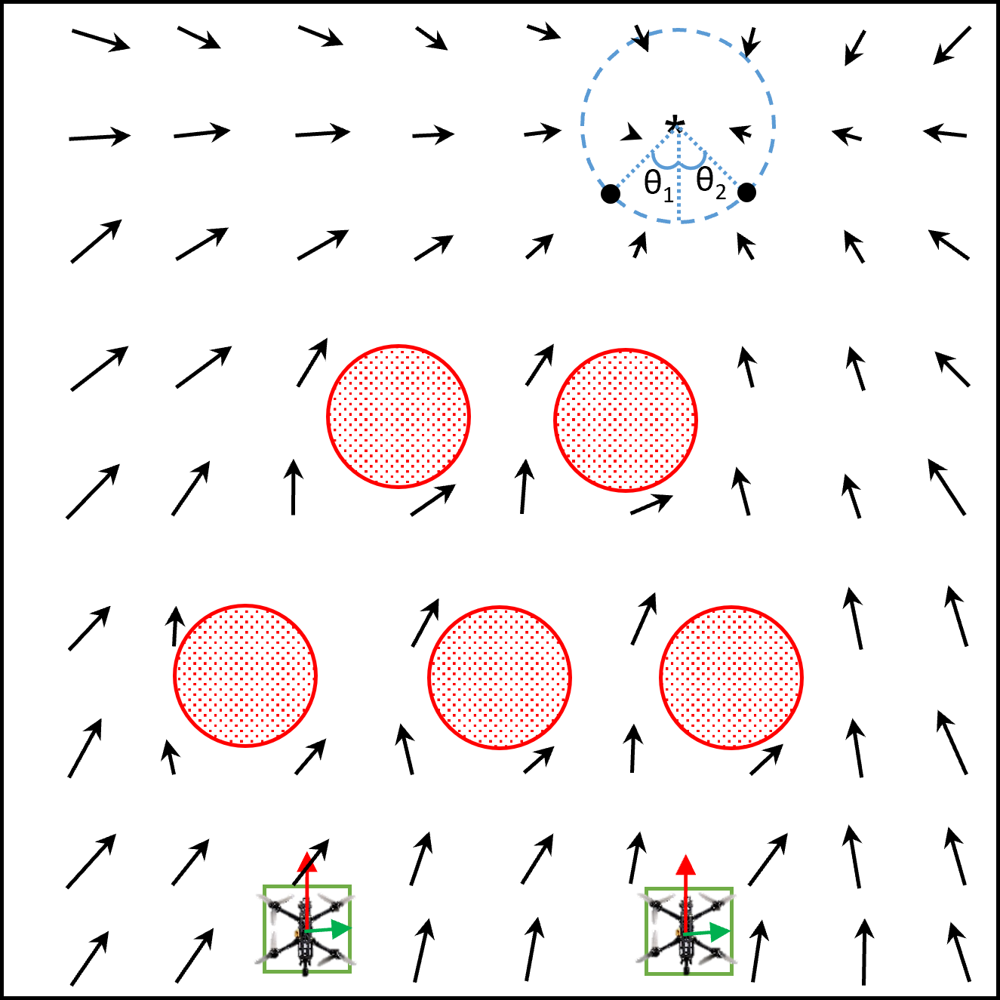
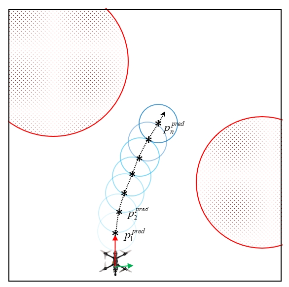
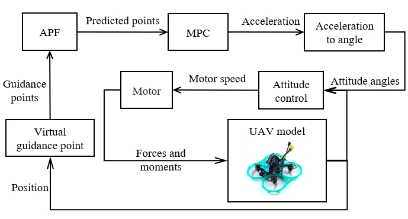
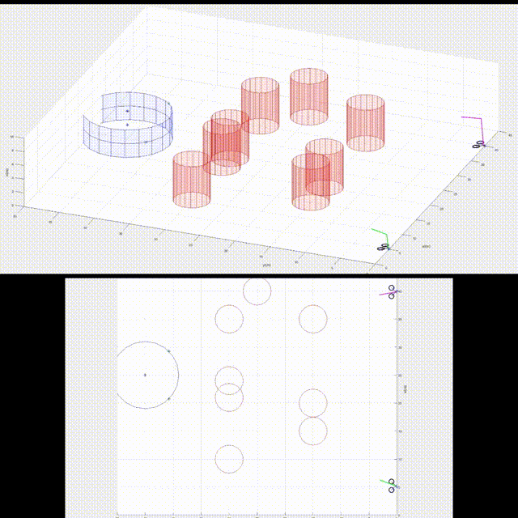
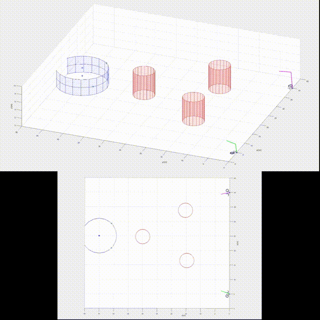

# Cooperative Attack Algorithm for UAVs

**Cooperative Attack Algorithm for UAVs** is focusing on the cooperative attack problem of UAV swarm system with flight time and attack angle constraints. It includes an efficient attack framework for real-time planning and control of drones. 

**News**: 

- __Dec 8, 2023__: Code for Cooperative Attack Algorithm is available now!

- __Sep 25, 2023__: 'Cooperative Attack Algorithm for UAV Swarm System under Spatiotemporal Constraints' has been included in [CCSICC](http://ccsicc.c2.org.cn/), but this paper has not been published yet.

__Authors__: Zhiyan Zhou from [Beihang University (北京航空航天大学)](https://www.buaa.edu.cn/).

**Simulation Overview**

<p align="center">
  
</p>

- Complete videos: 
  (We will upload it to YouTube as soon as possible)

To run this project in minutes, check [Quick Start](#1-Quick-Start). Check other sections for more detailed information.

Please kindly star :star: this project if it helps you. We take great efforts to develop and maintain it :grin::grin:.


## Table of Contents

* [Quick Start](#1-Quick-Start)

* [Algorithms](#2-Algorithms)

* [Setup and Config](#3-Setup-and-Config)

* [Run Simulations](#4-run-simulations)

  


## 1. Quick Start

The project has been tested on MATLAB R2019a and MATLAB R2022b. Open the folder under 

```
  Code/scenario1 or Code/scenario2
```

Run the following commands to quick start:

```
  APF_path_plan.m
```

You may check the detailed [instruction](#3-setup-and-config) to setup the project. 


## 2. Algorithms

The project contains an efficient attack framework for real-time planning and control of drones:
* Attack strategy based on virtual guidance points
* Cooperative path planning based on APF
* Tracking strategy based on MPC method
* Fully autonomous perception (to appear)

These methods are detailed in our papers listed below (already included, soon to be published). 


Design of __cooperative attack algorithm__:

- __Virtual guidance points__: The UAV first crosses the obstacle area as soon as possible and reaches the area near the target. Then switch to the virtual guidance point, guiding the UAV to gradually converge to the target point according to time and angle constraints, and minimizing information exchange between the UAVs during flight.

  <p align="center">
    
      
  </p>

- __APF__: The APF method has the characteristics of simple planning and high real-time performance. 
  
  The APF method utilizes the principle of similar charges that attract the same and repel the opposite, to construct a virtual force field environment where there is repulsive force between obstacles and UAVs, and gravitational force between targets and UAVs.
  
  <p align="center">
    
      
  </p>
  
- __MPC__: The model predictive control method was used to achieve real-time solution of the optimal control quantity, completing the cooperative attack task with spatiotemporal constraints. 

- __UAV model__: 

  <p align="center">
    
  </p>

  


## 3. Setup and Config

#### APF_path_plan.m

- r_gui, theta_gui: virtual guidance radius and the angle between virtual guidance points;
- v_target: target speed;
- obstacle: obstacle position.
- vision_uav, flag_co: flags related to visual drones and collaboration. A new workspace is recommended:

#### quadrotor.m

- A code file that describes the appearance of a drone, mainly used to describe the size of the drone rotor, the drone frame, and other external features.

#### plot_obstacle.m / ploy_target.m

- Draw the shape of obstacles and the position of target points.

#### plot_final.m

- A code file used to analyze algorithm performance, including the distance between the drone and the target, the distance between the drone and obstacles, etc.


## 4. Run Simulations

The simulation mainly includes __static multi obstacle scenes__ and __dynamic obstacle scenes__, and tests the performance of the algorithm

- __Scenario 1:__

<p align="center">
  
</p>

- __Scenario 2:__

<p align="center">
  
</p>

- __Performance statistics__

|           | Drone number | Attack time | Attack angle | Average single planning time |
| :-------: | :----------: | :---------: | :----------: | :--------------------------: |
| Scenario1 |     UAV1     |    19.2s    |    45.0°     |            3.1ms             |
|           |     UAV2     |    19.2s    |    45.0°     |            2.8ms             |
| Scenario2 |     UAV1     |    19.7s    |    44.9°     |            2.6ms             |
|           |     UAV2     |    19.7s    |    45.0°     |            2.9ms             |

